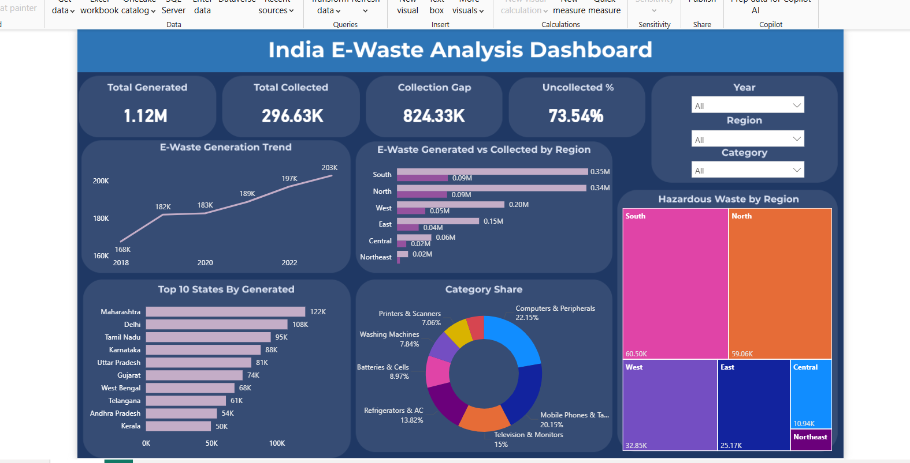

# 🗑️ India E-Waste Analysis (2018–2023)

A complete end-to-end data analysis project on electronic waste generation, collection, recycling, and hazardous waste across 20 Indian states — built across **Excel, SQL, Python, and Power BI**.

---

## 📊 Dashboard Preview



---

## 📁 File Structure

```
├── ewaste_india_raw.csv                  # Raw dataset (960 rows)
├── ewaste_india_raw.xlsx                 # Excel dashboard
├── ewaste_sql_queries.sql                # All 30 SQL queries
├── ewaste_analysis.ipynb                 # Python analysis notebook
├── ewaste_dashboard.pbix                 # Power BI dashboard
├── dashboard_preview.png                 # Dashboard screenshot
└── README.md                             # Project documentation
```

---

## 📌 Dataset Overview

| Property | Details |
|---|---|
| Total Records | 960 rows |
| States Covered | 20 Indian states |
| Years | 2018 – 2023 |
| Categories | 8 product categories |
| Data Type | Simulated — based on CPCB India growth trends |
| Source Inspiration | CPCB Annual Reports, MoEFCC E-Waste Rules 2022 |

### Columns

| Column | Description |
|---|---|
| State | Indian state |
| Region | North / South / East / West / Central / Northeast |
| Year | 2018 – 2023 |
| Category | Product category (Computers, Mobiles, TVs, etc.) |
| E-Waste Generated (Tonnes) | Total e-waste generated |
| E-Waste Collected (Tonnes) | Formally collected e-waste |
| Collection Rate (%) | Collected / Generated × 100 |
| Recycled (Tonnes) | Amount recycled from collected waste |
| Recycling Efficiency (%) | Recycled / Collected × 100 |
| Hazardous Waste (Tonnes) | Hazardous component of generated waste |

---

## 🔑 Key Insights

- 📦 **1.12M Tonnes** of e-waste generated across 2018–2023
- ♻️ Only **~26%** of e-waste is formally collected — **74% goes uncollected**
- 📍 **Maharashtra** is the top e-waste generating state (122K tonnes)
- 🌍 **South region** generates and collects the most e-waste nationally
- 📱 **Computers & Peripherals** dominate at 22% of total e-waste
- ☠️ **South region** contributes the most hazardous waste (60.5K tonnes)
- 📅 **2020** saw the smallest growth (0.4%) due to COVID-19 disruptions
- 📈 Collection rate improved from **~22% in 2018 to ~33% in 2023**

---

## 🛠️ Tools & Technologies

| Tool | Purpose |
|---|---|
| Microsoft Excel | Data cleaning, Pivot Tables, Charts, Dashboard |
| SQL Server (SSMS) | Database design, querying, advanced analytics |
| Python (Jupyter/Colab) | EDA, visualizations, trend analysis |
| Power BI | Interactive dashboard with DAX measures |
| Canva | Dashboard background design |

---

## 📋 Phase 1 — Excel

**File:** `ewaste_india_raw.xlsx`

Built an interactive Excel dashboard with:
- 7 Pivot Tables covering states, years, categories and regions
- 7 Charts — line, bar, donut, horizontal bar
- 3 Slicers — Region, Year, Category (connected to all pivots)

### Charts Built
| Chart | Type | Insight |
|---|---|---|
| E-Waste Generation Trend | Line | YoY growth with 2020 COVID dip |
| Top 5 States | Horizontal Bar | Maharashtra leads |
| Category Distribution | Donut | Computers & Peripherals = 22% |
| Collection Rate Trend | Line | Steady improvement 2018–2023 |
| Region Collection | Bar | South collects the most |
| Region Recycling | Bar | South recycles the most |
| Recycling Efficiency | Column | Consistent ~73% across regions |

---

## 📋 Phase 2 — SQL

**File:** `ewaste_sql_queries.sql`

**Database:** `ewaste_india_db` | **Table:** `dbo.ewaste_india_dat`

30 queries covering:

**Basic** — SELECT, COUNT, DISTINCT, filters

**Aggregations** — SUM, AVG, GROUP BY across states, regions, categories, years

**Ranking & Top N** — TOP 5/10, ORDER BY, HAVING

**Advanced**
| Query | Concept Used |
|---|---|
| States where collection < 25% | HAVING |
| Most hazardous category per region | CTE + RANK() |
| Year with best collection improvement | CTE + LAG() |
| Rank states within region | RANK() OVER PARTITION BY |
| Running total year by year | SUM() OVER() |
| Gap between generated and collected | Derived columns |
| Category % of national e-waste | SUM() OVER() for total |

---

## 📋 Phase 3 — Python

**File:** `ewaste_analysis.ipynb`

**Libraries:** Pandas, Matplotlib, Seaborn

### Analysis Performed
- National overview — total generated, collected, gap, collection rate
- State-wise — top 10 generators, bottom 5 collection rates, most hazardous state
- Year-wise — YoY trend, collection rate improvement, COVID dip identification
- Category-wise — top contributor, most hazardous, best recycling efficiency
- Region-wise — generated vs collected, recycling efficiency comparison

### Visualizations Built
| Chart | Library |
|---|---|
| Top 10 States — Horizontal Bar | Matplotlib |
| Year-over-Year Trend — Line | Matplotlib |
| Category Share — Pie | Matplotlib |
| Collection Rate Trend — Line | Matplotlib |
| Region Generated vs Collected — Grouped Bar | Matplotlib |
| Correlation Matrix — Heatmap | Seaborn |
| Hazardous Waste by Region — Bar | Seaborn |

---

## 📋 Phase 4 — Power BI

**File:** `ewaste_dashboard.pbix`

### DAX Measures Created
```dax
Total Generated   = SUM('ewaste_india_raw'[E-Waste Generated (Tonnes)])
Total Collected   = SUM('ewaste_india_raw'[E-Waste Collected (Tonnes)])
Total Recycled    = SUM('ewaste_india_raw'[Recycled (Tonnes)])
Total Hazardous   = SUM('ewaste_india_raw'[Hazardous Waste (Tonnes)])
Collection Gap    = [Total Generated] - [Total Collected]
Collection Rate % = DIVIDE([Total Collected], [Total Generated]) * 100
Recycling Rate %  = DIVIDE([Total Recycled], [Total Collected]) * 100
Uncollected %     = ROUND(DIVIDE([Collection Gap], [Total Generated]) * 100, 2)
```

### Dashboard Layout

**Row 1 — KPI Cards**
Total Generated · Total Collected · Collection Gap · Uncollected % · Slicers (Year, Region, Category)

**Row 2 — Trend Charts**
E-Waste Generation Trend (Line) · E-Waste Generated vs Collected by Region (Clustered Bar)

**Row 3 — Breakdown Charts**
Top 10 States (Bar) · Category Share (Donut) · Hazardous Waste by Region (Treemap)

---

## ▶️ How to Run

**Excel**
1. Open `ewaste_india_raw.xlsx` in Microsoft Excel 2016+
2. Use slicers to filter by Region, Year, Category

**SQL**
1. Import `ewaste_india_raw.csv` into SQL Server
2. Open `ewaste_sql_queries.sql` in SSMS
3. Run queries against `ewaste_india_db`

**Python**
1. Upload `ewaste_india_raw.csv` to Google Colab or Jupyter
2. Open `ewaste_analysis.ipynb`
3. Run all cells in order

**Power BI**
1. Open `ewaste_dashboard.pbix` in Power BI Desktop
2. Use slicers to explore the data interactively

---

## 📄 Requirements

| Tool | Version |
|---|---|
| Microsoft Excel | 2016 or later |
| SQL Server | Any edition with SSMS |
| Python | 3.8+ |
| Power BI Desktop | Latest (free) |

**Python libraries:**
```
pip install pandas matplotlib seaborn
```
---

## 🙋 Author

**Sumit Pandey**
- GitHub: https://github.com/pandeysumitt

---

## 📄 License

This project is for educational and portfolio purposes.
Data is simulated based on CPCB India e-waste trends and MoEFCC E-Waste Rules 2022.
